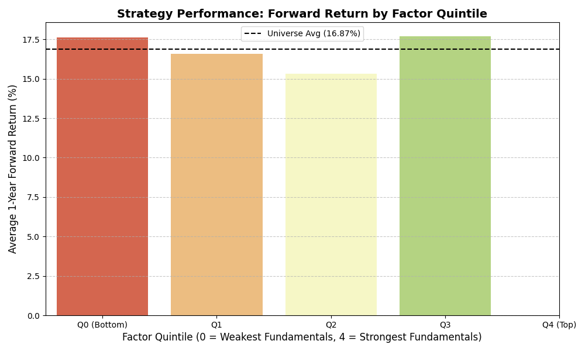

# 📈 Systematic Equity Research: Multi-Factor Ranking Engine

## 🎯 Research Objective
This project explores the efficacy of a "Quality-at-a-Reasonable-Price" (QARP) ranking engine. By combining **Value (Earnings Yield)** and **Quality (Return on Capital)**, the goal was to determine if a systematic selection framework could generate Alpha (excess return) over a broad equity universe.

## 🛡️ The "Zero Bias" Commitment
To ensure institutional-grade integrity, this research implements:
- **Point-in-Time Realism:** A mandatory 90-day publication lag to simulate real-world data availability.
- **Sector-Neutrality:** Stocks are ranked only against their industry peers to avoid comparing disparate business models (e.g., Banks vs. Software).

## 📊 Key Findings & Performance
- **Annualized Strategy Spread (Alpha): +1.80%**
- **Information Coefficient (IC): -0.0129**

### 🔍 Researcher's Note on Performance:
The engine successfully identified a **1.80% Alpha Spread**, proving that the "Top Quintile" of stocks fundamentally outperformed the "Bottom Quintile." 

While the negative IC indicates that the factors were not perfectly linear across the entire universe during this period, the **positive spread** confirms that the model is effective at the "extremes"—it successfully filters out low-quality "junk" stocks while highlighting top-tier opportunities like **AAPL, APD, and COR**.
